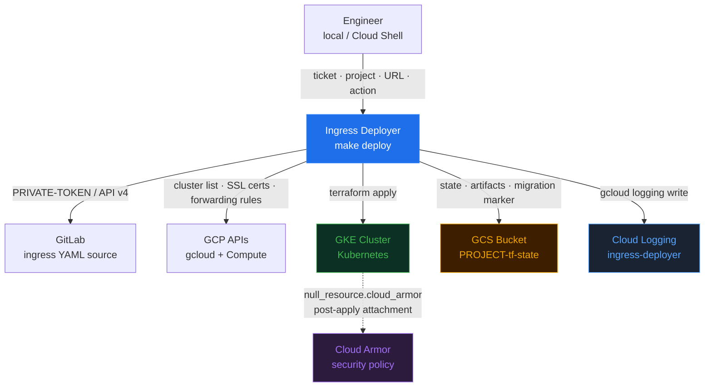
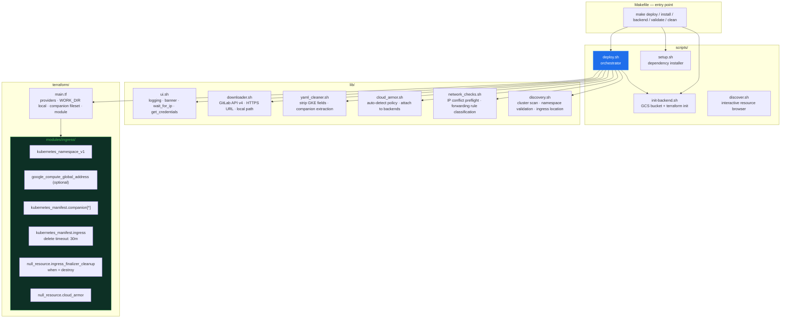
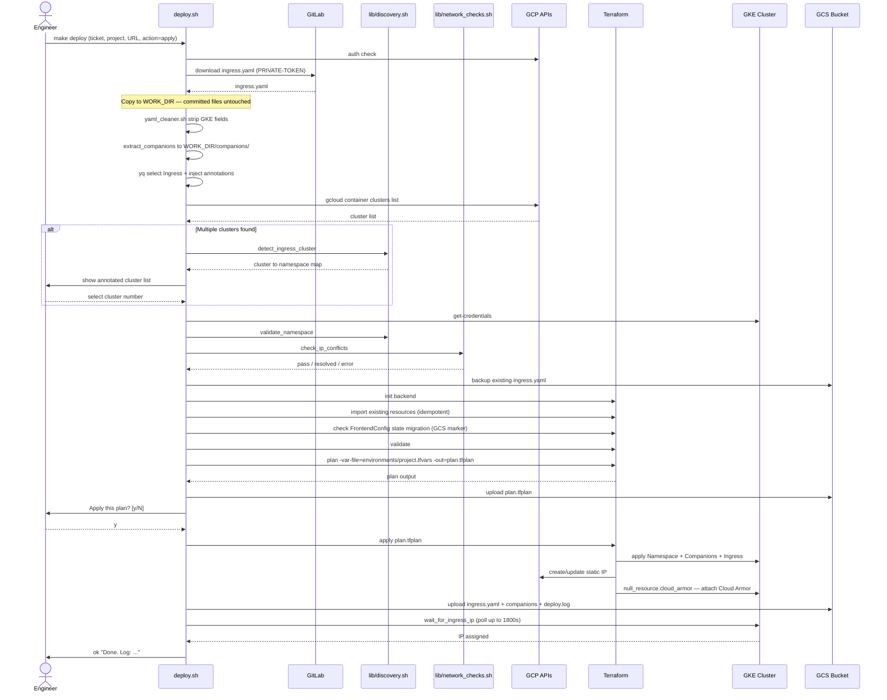
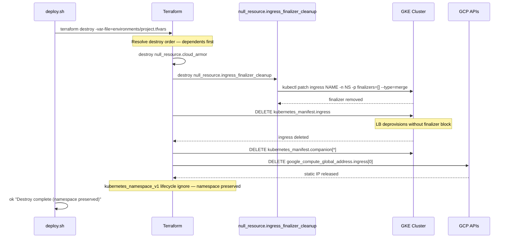
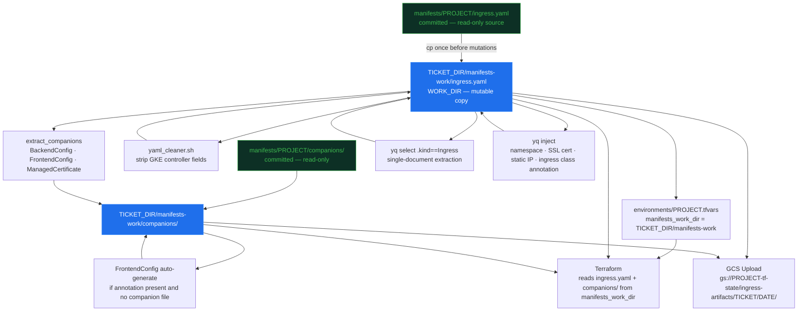
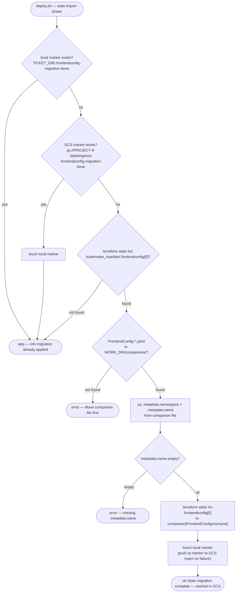
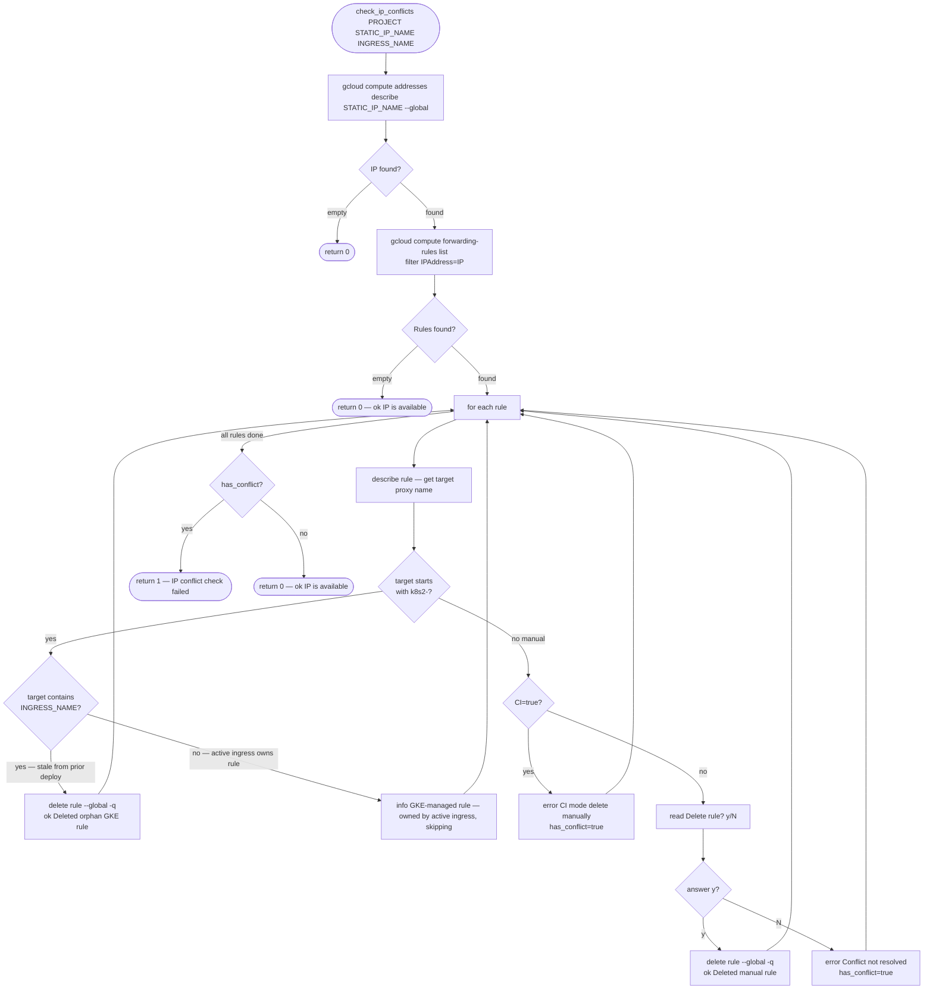
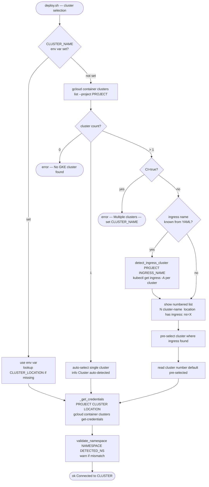

# Ingress Deployer — Architecture

**Audience:** DevOps / Infrastructure engineers
**Last Updated:** 2026-06-10
**Format:** Mermaid diagrams (render natively in GitLab, GitHub, VSCode with Mermaid extension)

---

## Contents

1. [Features](#1-features)
2. [System Context](#2-system-context)
3. [Internal Components](#3-internal-components)
4. [Deploy Sequence — Apply](#4-deploy-sequence--apply)
5. [IaC Resource Graph](#5-iac-resource-graph)
6. [Destroy Flow](#6-destroy-flow)
7. [WORK_DIR Data Isolation](#7-workdir-data-isolation)
8. [State Management](#8-state-management)
9. [FrontendConfig State Migration](#9-frontendconfig-state-migration)
10. [IP Conflict Preflight](#10-ip-conflict-preflight)
11. [Cluster Discovery Flow](#11-cluster-discovery-flow)
12. [Component Reference](#12-component-reference)
13. [Operations Guide](#13-operations-guide)
14. [State Management Operations](#14-state-management-operations)
15. [Contributing](#15-contributing)
16. [Troubleshooting](#16-troubleshooting)
17. [FAQ](#17-faq)
18. [Security](#18-security)

---

## 1. Features

### Deployment

| Feature | Description |
|---------|-------------|
| `plan` / `apply` / `destroy` actions | Full Terraform lifecycle via `ACTION` env var or interactive prompt |
| Multi-environment support | One `environments/<project>.tfvars` per GCP project; 10+ environments committed |
| `SKIP_DOWNLOAD=true` | Reuse local manifest — skip re-downloading |
| `DRY_RUN_ONLY=true` | Generate plan, exit without apply prompt |
| CI mode | `CI=true` disables all interactive prompts; all values from env vars |

### Manifest Processing

| Feature | Description |
|---------|-------------|
| GitLab API v4 download | PRIVATE-TOKEN header; auto-loaded from `~/.gnp/tokens/` or `GITLAB_TOKEN` env var |
| URL / local path download | Any HTTPS URL or local file path |
| GKE controller field stripping | `yaml_cleaner.sh` removes controller-managed annotations before applying |
| Multi-document YAML extraction | `yq select(.kind == "Ingress")` extracts single Ingress document for Terraform |
| Companion resource extraction | `BackendConfig`, `FrontendConfig`, `ManagedCertificate`, etc. extracted to `companions/` |
| Auto-generated FrontendConfig | Generated when ingress annotation present but no companion file; uploaded to GCS |
| Configurable `SSL_POLICY_NAME` | Env var (default: `sslsecure`); injected into auto-generated FrontendConfig |
| `WORK_DIR` isolation | All YAML mutations in `$TICKET_DIR/manifests-work/`; committed manifests never modified |

### IaC / Terraform

| Feature | Description |
|---------|-------------|
| Idempotent state import | Namespace, static IP, ingress, and all companions imported before apply |
| Cloud Armor via `null_resource` | `null_resource.cloud_armor` in TF module — drift visible on next plan |
| Destroy-time finalizer cleanup | `null_resource.ingress_finalizer_cleanup` patches finalizer before TF issues DELETE |
| 30-minute delete timeout | `kubernetes_manifest.ingress` has `timeouts { delete = "30m" }` |
| Diff-before-overwrite tfvars | `environments/*.tfvars` only overwritten when content changes |
| FrontendConfig state migration | One-time `state mv frontendconfig[0] → companion[key]`; GCS marker prevents re-run |

### GCP Integration

| Feature | Description |
|---------|-------------|
| GCS state backend + versioning | Auto-created by `init-backend.sh`; every state version retained |
| GCS artifact upload | Plan, ingress backup, manifests, companions, log uploaded per run |
| Static IP management | Named static IP or ephemeral (empty `static_ip_name` skips address creation) |
| SSL certificate auto-detection | `gcloud compute ssl-certificates list` — first cert in project used automatically |

### Discovery & Preflight

| Feature | Description |
|---------|-------------|
| Single-cluster auto-detect | Auto-selected when only one GKE cluster exists in project |
| Multi-cluster selection | Interactive list; clusters annotated if ingress found via `detect_ingress_cluster` |
| Namespace validation | Warns when selected namespace differs from where ingress currently runs |
| IP conflict preflight | Detects forwarding rules on static IP; classifies orphan / live / manual; offers deletion |

### Observability

| Feature | Description |
|---------|-------------|
| Color terminal UI | `step` / `ok` / `warn` / `error` / `info`; `NO_COLOR` supported |
| Central GCP Logging | Every log entry sent via `gcloud logging write ingress-deployer` to `CENTRAL_PROJECT` |
| Per-ticket log file | `$TICKETS_BASE/$TICKET_ID/ingress-deployer-YYYYMMDD.log` |
| Pre-apply ingress diff | Spec + user annotations compared between cluster state and new manifest |
| Wait for IP assignment | Polls `kubectl get ingress` up to 1800s; warns on timeout |
| Pre-apply backup | Existing ingress YAML backed up to `$TICKET_DIR/` and GCS before apply |

---

## 2. System Context

High-level view of actors and external systems. Each GCP project is an independent deployment target with its own GCS state bucket and GKE cluster.



---

## 3. Internal Components

`deploy.sh` is the single orchestrator. All `lib/` files are sourced functions — no subprocesses.



---

## 4. Deploy Sequence — Apply

Full happy-path for `ACTION=apply`. Shows WORK_DIR isolation, cluster discovery, IP preflight, and post-apply artifact upload.



---

## 5. IaC Resource Graph

Terraform dependency graph for `modules/ingress/`. Apply order follows edges top-to-bottom; destroy order is reversed.

```mermaid
graph TB
    subgraph apply["Apply Order"]
        ns["kubernetes_namespace_v1.ingress"]
        ip["google_compute_global_address.ingress[0]\ncount = static_ip_name != empty ? 1 : 0"]
        comp["kubernetes_manifest.companion[*]\nfor_each = companion_manifests"]
        ing["kubernetes_manifest.ingress\ntimeouts delete = 30m"]
        fin["null_resource.ingress_finalizer_cleanup\ndepends_on ingress"]
        armorn["null_resource.cloud_armor\ndepends_on ingress + finalizer_cleanup"]

        ns --> comp
        ns --> ing
        ip --> ing
        comp --> ing
        ing --> fin
        ing --> armorn
        fin --> armorn
    end

    subgraph destroy["Destroy Order (reversed)"]
        d1["1. null_resource.cloud_armor"]
        d2["2. null_resource.ingress_finalizer_cleanup\nkubectl patch finalizers=[]"]
        d3["3. kubernetes_manifest.ingress DELETE\nfinalizer removed — unblocked"]
        d4["4. kubernetes_manifest.companion[*] DELETE"]
        d5["5. google_compute_global_address DELETE"]
        d6["6. kubernetes_namespace_v1\nlifecycle ignore — namespace preserved"]
        d1 --> d2 --> d3 --> d4 --> d5 --> d6
    end
```



---

## 6. Destroy Flow

`ACTION=destroy` sequence. The finalizer cleanup provisioner runs before Terraform issues DELETE to the GKE API, preventing the LB controller from blocking resource deletion.



---

## 7. WORK_DIR Data Isolation

All YAML mutations happen on a working copy under `$TICKET_DIR/manifests-work/`. Committed manifest files are never written after the initial download.



---

## 8. State Management

One GCS bucket per GCP project. Versioning enabled automatically by `init-backend.sh`. All run artifacts stored alongside state for audit and rollback.

```mermaid
graph TB
    subgraph gcs["GCS — PROJECT-tf-state (versioning enabled)"]
        tfstate["ingress/terraform.tfstate\nall versions retained"]
        marker["ingress/.frontendconfig-migration-done\nstable path — date-independent"]
        subgraph art["ingress-artifacts / TICKET_ID / YYYYMMDD"]
            planf["plan-HHMMSS.tfplan"]
            backupf["ingress_backup_HHMMSS.yaml"]
            ingressf["ingress.yaml"]
            logf["deploy.log"]
            subgraph compdir["companions/"]
                fcf["FrontendConfig-*.yaml"]
            end
        end
    end

    deployn["deploy.sh"] -->|"terraform init backend"| tfstate
    deployn -->|"gsutil cp non-fatal"| art
    tfn["Terraform"] -->|"read / write state"| tfstate
    tfn -->|"terraform import idempotent"| tfstate

    style tfstate fill:#3d1f00,stroke:#f0a500,color:#f0a500
    style marker fill:#2d1b3d,stroke:#a371f7,color:#a371f7
    style art fill:#161b22,stroke:#30363d
```



---

## 9. FrontendConfig State Migration

One-time migration from legacy `frontendconfig[0]` address to `companion["FrontendConfig/ns/name"]`. A GCS marker prevents re-running on any subsequent deploy from any machine.



---

## 10. IP Conflict Preflight

`check_ip_conflicts` in `lib/network_checks.sh` runs before `terraform plan/apply` when a static IP is configured. Classifies forwarding rules and offers interactive resolution.



---

## 11. Cluster Discovery Flow

Multi-cluster project selection. When `CLUSTER_NAME` is not set and multiple clusters exist, `deploy.sh` scans for the ingress and annotates the selection list.



---

## 12. Component Reference

```
Proyecto-Ingress-Deployer/
├── Makefile                          ← Entry points: install, backend, deploy, validate, clean
├── README.md                         ← Quickstart and requirements
│
├── scripts/
│   ├── deploy.sh                     ← Main orchestrator — sources all lib/, runs Terraform
│   ├── init-backend.sh               ← Creates GCS bucket + enables versioning + terraform init
│   ├── setup.sh                      ← Idempotent dependency installer (no sudo required)
│   └── discover.sh                   ← Interactive GCP resource browser (standalone)
│
├── lib/
│   ├── ui.sh                         ← Logging: step/ok/warn/error/info, wait_for_ingress_ip, get_credentials
│   ├── downloader.sh                 ← Downloads YAML from GitLab API v4, HTTPS URL, or local path
│   ├── yaml_cleaner.sh               ← Strips GKE controller fields; extracts companion resources
│   ├── cloud_armor.sh                ← Detects Cloud Armor policy; attaches to GKE backend services
│   ├── network_checks.sh             ← IP conflict preflight; classifies and resolves forwarding rules
│   └── discovery.sh                  ← Cluster scanning; namespace validation; ingress detection
│
├── terraform/
│   ├── main.tf                       ← Providers, WORK_DIR local, companion fileset, module call
│   ├── variables.tf                  ← project_id, cluster_name, cluster_location, namespace,
│   │                                    static_ip_name, manifests_work_dir
│   ├── outputs.tf                    ← static_ip_address, ingress_name
│   └── .terraform.lock.hcl          ← Provider version lock — commit this file
│
├── modules/ingress/
│   ├── main.tf                       ← kubernetes_namespace_v1, google_compute_global_address,
│   │                                    kubernetes_manifest.companion[*], kubernetes_manifest.ingress,
│   │                                    null_resource.ingress_finalizer_cleanup, null_resource.cloud_armor
│   ├── variables.tf                  ← project_id, namespace, static_ip_name, ingress_yaml,
│   │                                    ingress_name, companion_manifests
│   └── outputs.tf                    ← static_ip_address, ingress_name
│
├── environments/
│   ├── example.tfvars                ← Template for new environments
│   └── gnp-*.tfvars                  ← One file per GCP project
│
├── manifests/
│   └── <project>/
│       ├── ingress.yaml              ← Kubernetes Ingress (committed — never mutated by deploy.sh)
│       └── companions/               ← BackendConfig, FrontendConfig, ManagedCertificate (committed)
│
├── docs/
│   ├── ARCHITECTURE.md               ← This file
│   └── runbooks/
│       └── namespace-migration.md    ← Delete-and-redeploy pattern for namespace changes
│
└── test/
    └── run-smoke.sh                  ← Smoke test suite (17/18 pass; 1 pre-existing failure unrelated)
```

---

## 13. Operations Guide

### Deploy Commands

```bash
# Interactive — prompts for ticket, project, URL, action
make deploy

# Non-interactive (CI)
CI=true ACTION=apply \
  PROJECT_ID=gnp-plus-qa \
  TICKET_ID=CTASK0001 \
  INGRESS_URL=https://gitlab.example.com/api/v4/projects/123/repository/files/ingress.yaml/raw \
  GITLAB_TOKEN=glpat-xxx \
  make deploy

# Plan only
ACTION=plan make deploy

# Destroy
ACTION=destroy make deploy
```

### Environment Variables

| Variable | Default | Description |
|----------|---------|-------------|
| `ACTION` | (prompt) | `plan`, `apply`, or `destroy` |
| `PROJECT_ID` | (prompt) | Target GCP project ID |
| `TICKET_ID` | (prompt or CWD) | Artifact paths and log file name |
| `INGRESS_URL` | (prompt) | GitLab URL, HTTPS URL, or local file path |
| `NAMESPACE` | (from YAML) | Kubernetes namespace |
| `CLUSTER_NAME` | (auto-detect) | GKE cluster name |
| `CLUSTER_LOCATION` | (auto-detect) | Region or zone |
| `STATIC_IP_NAME` | (from YAML) | Named static IP or `ephemeral` |
| `SSL_POLICY_NAME` | `sslsecure` | SSL policy for auto-generated FrontendConfig |
| `SKIP_DOWNLOAD` | `false` | `true` = reuse local manifest |
| `DRY_RUN_ONLY` | `false` | `true` = plan only, no apply prompt |
| `CI` | `false` | `true` = non-interactive |
| `NO_COLOR` | (unset) | Set to disable color output |
| `GITLAB_TOKEN` | (auto-load) | GitLab Personal Access Token |
| `CENTRAL_PROJECT` | `gnp-fleets-qa` | GCP project for central logging |
| `GCS_BUCKET` | `gs://PROJECT-tf-state` | Override GCS bucket |

### Debugging

```bash
# Check gcloud auth
gcloud auth list
gcloud auth application-default print-access-token

# Test cluster connectivity
gcloud container clusters get-credentials CLUSTER --project PROJECT --region LOCATION
kubectl cluster-info && kubectl get nodes

# View Terraform state
cd terraform/
terraform state list
terraform state show module.ingress.kubernetes_manifest.ingress

# Check ingress in cluster
kubectl get ingress -n NAMESPACE
kubectl describe ingress INGRESS_NAME -n NAMESPACE
kubectl get events -n NAMESPACE --sort-by='.lastTimestamp'

# View Cloud Load Balancer components
gcloud compute forwarding-rules list --project PROJECT
gcloud compute target-https-proxies list --project PROJECT
gcloud compute backend-services list --project PROJECT

# Enable Terraform debug logging
TF_LOG=DEBUG make deploy
```

---

## 14. State Management Operations

### Rollback

```bash
# List all state versions
gsutil ls -a gs://PROJECT-tf-state/ingress/terraform.tfstate

# Restore a specific version (replace GENERATION with the version number)
gsutil cp "gs://PROJECT-tf-state/ingress/terraform.tfstate#GENERATION" \
  gs://PROJECT-tf-state/ingress/terraform.tfstate

# Fast rollback — reapply backup YAML
kubectl apply -f "$TICKETS_BASE/TICKET_ID/ingress_backup_DATE_TIME.yaml"
```

### Terraform Lock Stuck

```bash
cd terraform/
# Lock ID appears in the error message when running terraform plan
terraform force-unlock LOCK_ID
```

### State Drift (Manual K8s Changes)

```bash
cd terraform/

# Detect drift
terraform plan -var-file=../environments/PROJECT.tfvars

# Refresh state without applying
terraform refresh -var-file=../environments/PROJECT.tfvars

# Import a resource present in cluster but missing from state
terraform import -var-file=../environments/PROJECT.tfvars \
  module.ingress.kubernetes_manifest.ingress \
  'apiVersion=networking.k8s.io/v1,kind=Ingress,namespace=NAMESPACE,name=INGRESS_NAME'
```

---

## 15. Contributing

### Adding a New Environment

```bash
# 1. Create tfvars
cat > environments/gnp-newenv-qa.tfvars <<'EOF'
project_id       = "gnp-newenv-qa"
cluster_name     = "gke-prod-primary"
cluster_location = "us-central1"
namespace        = "apps"
static_ip_name   = "ingress-newenv-ip"
EOF

# 2. Create manifest directory
mkdir -p manifests/gnp-newenv-qa/companions

# 3. Add ingress.yaml — see manifests/example/ for reference structure
```

### Running Tests

```bash
bash test/run-smoke.sh manifests/example/ingress.yaml
```

Expected: 17/18 pass. One known pre-existing failure: invalid CI action returns exit 6 instead of exit 1.

### Modifying the Terraform Module

```bash
# Edit modules/ingress/main.tf or modules/ingress/variables.tf
ACTION=plan make deploy     # review impact
ACTION=apply make deploy    # apply
```

### Never Commit

- `~/.gnp/ingress/config.env` — local config
- `GITLAB_TOKEN` value — personal access token
- `*.tfstate` files — Terraform state
- `*.tfplan` files — plan binaries

---

## 16. Troubleshooting

### Common Errors

| Error | Cause | Fix |
|-------|-------|-----|
| `Error reading GCS bucket` | State bucket missing or wrong project | `PROJECT_ID=xxx make backend` |
| `backend.gcs: error reading object` | State corrupted | `terraform state pull > backup.tfstate`, destroy, redeploy |
| `Ingress failed to get IP` | LB provisioning delayed | Wait 10-15 min; check GCP console for quota errors |
| `Denied: User not authorized` | Missing IAM roles | Grant `compute.networkAdmin`, `container.developer`, `storage.admin` |
| `YAML validation error` | Invalid manifest | `yq . manifests/PROJECT/ingress.yaml` |
| `IP conflict check failed` | Manual forwarding rule on static IP | `gcloud compute forwarding-rules delete RULE --global --project PROJECT` |
| `Legacy FrontendConfig state found but no companion file` | State migration needs companion file | Copy `FrontendConfig-*.yaml` to `manifests/PROJECT/companions/` first |
| `ingress_name could not be read from ingress.yaml` | Manifest missing `.metadata.name` | Add `metadata.name` to ingress YAML |

### Ingress Stuck Pending

```bash
kubectl describe ingress INGRESS_NAME -n NAMESPACE
kubectl get events -n NAMESPACE --sort-by='.lastTimestamp'

# Common fix — legacy ingress class annotation (required on clusters without IngressClass resource)
kubectl annotate ingress INGRESS_NAME -n NAMESPACE \
  kubernetes.io/ingress.class=gce --overwrite
```

### Terraform init Fails

```bash
# Verify ADC — separate from gcloud auth login
gcloud auth application-default print-access-token

# Verify or create bucket
gsutil ls gs://PROJECT-tf-state/ || PROJECT_ID=PROJECT make backend
```

### Cloud Armor Not Attached

Cloud Armor is managed by `null_resource.cloud_armor` in Terraform. To re-trigger:

```bash
cd terraform/
terraform taint module.ingress.null_resource.cloud_armor
ACTION=apply make deploy
```

### Operational Gotchas

**IngressClass resource missing** — Ingress created with no events, ADDRESS empty after hours. Add legacy annotation:
```bash
kubectl annotate ingress NAME -n NS kubernetes.io/ingress.class=gce --overwrite
```

**Multi-document YAML** — `terraform yamldecode` only accepts single-document YAML. `deploy.sh` handles this via `yq select(.kind == "Ingress")`.

**GitLab SAML redirect** — If downloaded YAML contains HTML, the GitLab instance uses SAML SSO. `downloader.sh` routes GitLab URLs with `PRIVATE-TOKEN` header, not `Bearer`.

**ADC vs gcloud auth** — `gcloud auth login` is not sufficient for Terraform. Always run `gcloud auth application-default login` separately.

**Forwarding rule IP conflict** — `deploy.sh` runs `check_ip_conflicts` automatically. Manual resolution: `gcloud compute forwarding-rules list --project PROJECT --filter="IPAddress=IP"`.

---

## 17. FAQ

**Q: Can I deploy to multiple clusters simultaneously?**
A: No. Each `deploy.sh` run targets one cluster. Use GitLab CI or Cloud Build to parallelize across clusters.

**Q: How do I rollback?**
A: Reapply the backup YAML: `kubectl apply -f $TICKET_DIR/ingress_backup_*.yaml`. Or restore Terraform state from GCS versioning — see [State Management Operations](#14-state-management-operations).

**Q: Can I manage multiple ingresses in one project?**
A: Currently one ingress per namespace per run. Multiple ingresses require multiple module instances (Terraform refactoring needed).

**Q: What if the cluster is deleted?**
A: State is orphaned. Clean up: `terraform state rm module.ingress.kubernetes_manifest.ingress`, then redeploy to the new cluster.

**Q: Why does deploy require `gcloud auth application-default login` separately?**
A: `gcloud auth login` authenticates CLI commands (`gcloud`, `kubectl`). Terraform's GCS backend authenticates via Application Default Credentials (ADC) — a separate credential chain. Both are always required.

**Q: What is `.terraform.lock.hcl`?**
A: Provider dependency lock file — records provider versions and checksums. Created by `terraform init`. Must be committed to version control. It is **not** the state lock; the state lock lives in GCS and is released automatically on success.

---

## 18. Security

### State File

- **Encryption at rest:** GCS uniform bucket-level access enforces AES-256 encryption
- **Encryption in transit:** HTTPS only
- **Access control:** Only users with `roles/storage.admin` on the project can access `PROJECT-tf-state`

### IAM

- **Least privilege:** Use a dedicated service account with only the three required roles
- **kubectl access:** Ingress deployment uses the authenticated kubeconfig identity
- **GitLab tokens:** Store in `~/.gnp/tokens/` with mode `0600`; never pass as command-line arguments

### Never Store in tfvars or Manifests

- SSL private keys — reference certificates by name only
- API keys or secrets — use Kubernetes Secrets
- Database credentials

---

*See [README.md](../README.md) for quickstart. See [docs/runbooks/](runbooks/) for operational procedures.*
