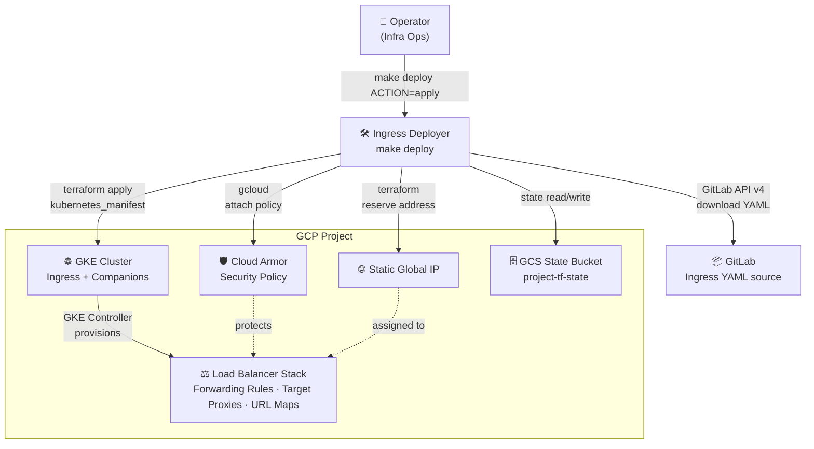
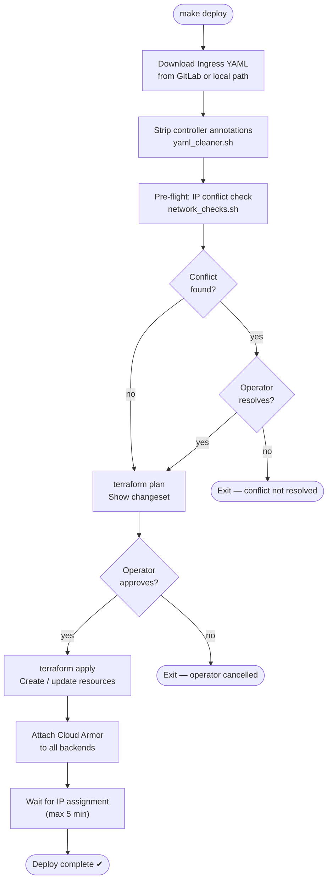
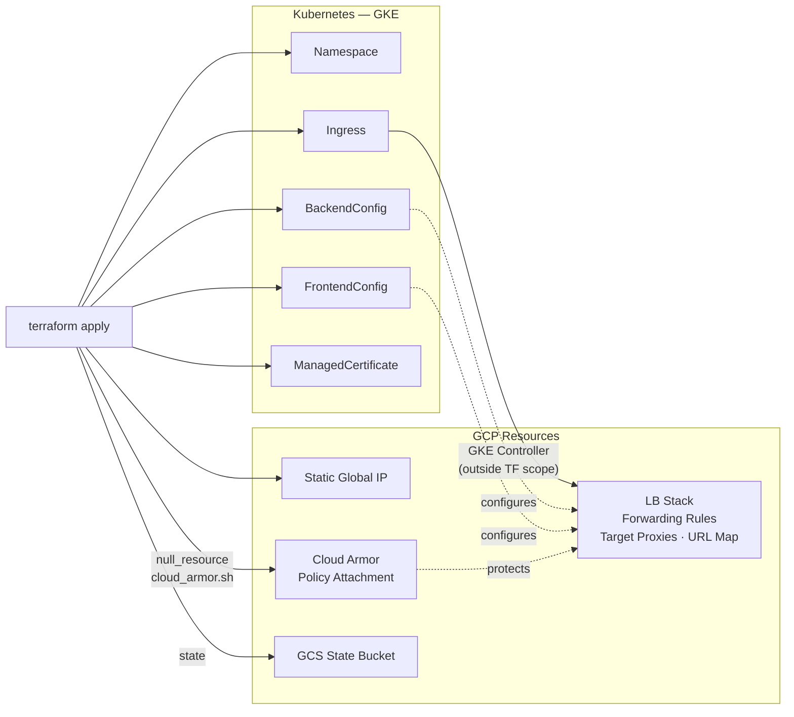

# Managing GKE Ingress with Terraform — State of the System

**Prepared by:** GNP Infrastructure Operations  
**Date:** June 16, 2026  
**Audience:** Technical Managers, Architects, C-Suite  
**Status:** Production — Phase 1 & 2 Complete, Phase 3 In Progress

---

## 1. Executive Summary

GNP currently manages GKE Ingress resources — including load balancer configuration, SSL certificates, Cloud Armor security policies, and HTTP→HTTPS redirection — through a Terraform-based deployment tool called **Ingress Deployer**. The tool has been in active use since 2021 across **12+ GCP projects**. Since formal adoption in May 2026, **13 confirmed production deployments** via `make deploy` have been executed across QA, UAT, and production — spanning 10 distinct GCP projects. Prior to adoption, the same environments were managed manually via kubectl; 51 historical ingress tickets exist in the archive.

**Key outcomes delivered:**
- Single-command deployment (`make deploy`) replaces a multi-step manual kubectl process, reducing operator error on a class of infrastructure that has historically caused silent misconfigurations and GCP LB conflicts.
- Cloud Armor security policies are automatically attached to all backend services on every deploy — 15/15 backends confirmed on the most recent production run.
- Terraform state stored in GCS provides an audit trail and enables drift detection across all managed environments.
- Two live production incidents caused by pre-existing manual GCP LB configurations were diagnosed and resolved this cycle; root-cause fixes were committed to prevent recurrence.

**One open gap requires attention:** The CI pipeline (automated lint and smoke tests) has not been implemented. Until it is, correctness relies on operator discipline. **Recommendation: do not onboard new production environments until Phase 3 (CI Pipeline) is complete.**

**Overall assessment: continue and expand with the CI pipeline condition.**

### System Context



---

## 2. Current State

### Environments Under Management

| Environment | GCP Project | Stage | Ingress Age |
|---|---|---|---|
| gnp-suscribe-uat | gnp-suscribe-uat | UAT | 5+ years |
| gnp-suscribe-asistidos-pro | gnp-suscribe-asistidos-pro | Production | 5+ years |
| gnp-suscribe-asistidos-uat | gnp-suscribe-asistidos-uat | UAT | — |
| gnp-stela-pro | gnp-stela-pro | Production | — |
| gnp-soycliente-uat | gnp-soycliente-uat | UAT | — |
| gnp-soyclientemorales-qa | gnp-soyclientemorales-qa | QA | — |
| gnp-plus-qa | gnp-plus-qa | QA | — |
| gnp-hogarversatil-qa | gnp-hogarversatil-qa | QA | — |
| gnp-protecciondatosper-qa | gnp-protecciondatosper-qa | QA | — |
| gnp-reglasprevencionfyf-qa | gnp-reglasprevencionfyf-qa | QA | — |
| gnp-tipoevaluacion-qa | gnp-tipoevaluacion-qa | QA | — |
| gnp-wsbancasegurogmm-pro | gnp-wsbancasegurogmm-pro | Production | — |
| gnp-capitalizaadf-qa | gnp-capitalizaadf-qa | QA | — |

Each environment has its own Terraform state bucket (`<project>-tf-state`) and `environments/<project>.tfvars` configuration file. State isolation ensures a failed deploy in one project cannot affect another.

### What Each Deploy Manages

For each GCP project, a single `make deploy` creates or updates:
- GKE Ingress object (with GKE Ingress Controller annotation handling)
- Companion resources: BackendConfig, FrontendConfig, ManagedCertificate (when present)
- Static global IP reservation (when configured)
- Cloud Armor policy attachment across all backend services
- Kubernetes namespace (created if missing)

### Completed Engineering Work

| Phase | Scope | Status |
|---|---|---|
| Phase 1 — Foundation | Bug fixes, portable paths, secure token setup | Complete |
| Phase 2 — GCP Compatibility | Cloud Armor discovery, Terraform computed_fields, annotation drift | Complete |
| Phase 3 — CI Pipeline | Automated lint, smoke tests, migration guide | **Not started** |

---

## 3. What the Tool Does — Feature Showcase

### Deploy Flow



### Resource Graph



### Capability Table

| Capability | Replaces | Business Outcome |
|---|---|---|
| `make deploy ACTION=apply` | Manual kubectl apply + gcloud commands across 5–8 steps | Consistent, repeatable deploys; any operator can run it |
| `make deploy ACTION=plan` | Mentally diffing YAML files | Explicit changeset before any modification is applied |
| `make deploy ACTION=destroy` | Manual kubectl delete + GCS cleanup | Clean teardown with LB finalizer handling; no orphaned GCP resources |
| Multi-environment via `.tfvars` | Per-environment runbook scripts | One codebase, 12+ environments; config in version control |
| GitLab manifest download | Manual file transfer or clipboard copy | Ingress YAML pulled from GitLab at deploy time; always up to date |
| Cloud Armor auto-attachment | Manual gcloud policy-add-association per backend | All backends protected on every deploy; policy drift detected and corrected |
| Static IP management | Manual address reservation + annotation | IP persists across redeploys; annotation and GCP resource kept in sync |
| Pre-flight IP conflict detection | Silent LB failures discovered post-apply | Operator warned (or conflicts auto-resolved) before Terraform runs |
| YAML key-order normalization | Spurious diffs on every plan | Clean plan output — only real changes appear |
| Namespace auto-detection from cluster | Operator must know and supply namespace | Works even when source YAML omits `metadata.namespace` |
| GCS state backend per project | Local state / shared state risk | Versioned, team-accessible state; concurrent deploy protection via GCS lock |
| Terraform drift detection | No visibility into config drift | `terraform plan` surfaces any out-of-band change to managed resources |

---

## 4. Pros — With Production Evidence

### 4.1 Declarative, Auditable Infrastructure

Terraform state in GCS records every resource created or modified. Any operator can run `terraform plan` and see exactly what will change before touching production. This matters for a class of resource (GKE Ingress + GCP LB stack) where misconfigurations are typically invisible until traffic fails.

*Evidence (CTASK0366373, CTASK0366374 — gnp-suscribe-uat, May 2026):* `terraform plan` revealed that controller-injected Kubernetes annotations were being flagged as drift on every run. The root cause (missing `computed_fields` configuration) was diagnosed from plan output and fixed — without this visibility, the issue would have remained silent. Since formal adoption in May 2026, confirmed `make deploy` executions span: `gnp-protecciondatosper-qa` (CTASK0369190), `gnp-hogarversatil-qa` (CTASK0369885, CTASK0370107), `gnp-soyclientemorales-qa` (CTASK0370316, CTASK0370760, CTASK0371075), `gnp-wsbancasegurogmm-pro` (CTASK0370461), `gnp-stela-pro` (CTASK0370664), `gnp-reglasprevencionfyf-qa` (CTASK0370851), `gnp-soycliente-uat` (CTASK0371080), `gnp-suscribe-uat` and `gnp-suscribe-asistidos-pro` (CTASK0372061).

### 4.2 Cloud Armor Enforcement at Deploy Time

Cloud Armor policies are not optional or per-operator. Every deploy attaches the configured policy to every backend service discovered via the Ingress annotation. Attachment is idempotent: already-attached backends are reported, not re-applied.

*Evidence (CTASK0372061 — gnp-suscribe-uat, Jun 16 2026):* 15/15 backend services confirmed attached in a single deploy. Zero manual steps required.

### 4.3 Single Command Across All Environments

`make deploy` with a project-scoped `.tfvars` file covers the full deploy lifecycle. No per-environment runbook. No operator memorizing cluster names, namespaces, or bucket paths. Credentials are resolved dynamically via `gcloud` — no static keys committed.

*Evidence (CTASK0372061 — Jun 16 2026):* `gnp-suscribe-uat` and `gnp-suscribe-asistidos-pro` deployed in the same session by two `make deploy` invocations. Across the ticket history, single-operator deployments span projects from `gnp-soyclientemorales-qa` (CTASK0370316, CTASK0370760, CTASK0371075) to `gnp-suscribe-uat` (CTASK0366373, CTASK0366374) with no per-environment runbook changes.

### 4.4 Rollback Capability — Manifest Layer

Because Ingress YAML and companion manifests are source-controlled, rolling back a configuration change is a `git revert` followed by `make deploy ACTION=apply`. Terraform computes the delta from current state and applies only what changed. For application-layer changes (path rules, backend service routing), this is reliable and fast.

*Evidence (CTASK0371075 → CTASK0372061 — gnp-soyclientemorales-qa):* `pre-shared-cert` annotation was accidentally omitted in a pull-request merge. Restored in a single `make deploy ACTION=apply` without downtime; Terraform computed only the annotation delta, leaving all routes and backends untouched.

### 4.5 Conflict Detection Prevents Silent LB Failures

The pre-flight check inspects GCP forwarding rules for IP conflicts before Terraform runs. Manual or legacy forwarding rules that would block GKE from creating its LB stack are surfaced to the operator with a delete prompt — not silently consumed mid-apply.

*Evidence (CTASK0372061 — Jun 16 2026):* Both `gnp-suscribe-uat` and `gnp-suscribe-asistidos-pro` had manually-created forwarding rules (`http`/`https`) occupying their static IPs — a configuration that predated this tool. After the fix committed this cycle (`acadb29`), the pre-flight correctly classifies non-GKE rules and prompts for removal before Terraform runs.

---

## 5. Cons & Real Risks — With Mitigation Status

### Risk Matrix

```mermaid
quadrantChart
    title Risk Posture — June 2026
    x-axis "Low Likelihood" --> "High Likelihood"
    y-axis "Low Impact" --> "High Impact"
    quadrant-1 Prioritize
    quadrant-2 Monitor Closely
    quadrant-3 Low Priority
    quadrant-4 Plan & Track
    No CI Pipeline: [0.80, 0.72]
    GCP LB Partial Rollback: [0.38, 0.88]
    FrontendConfig v1beta1: [0.28, 0.62]
    Provider < 3.0 Pin: [0.20, 0.42]
    Manual Onboarding: [0.65, 0.28]
```

> **Prioritize** (top-right): High likelihood + high impact — act now.  
> **Monitor Closely** (top-left): Low likelihood but severe if it occurs — gate before cluster upgrades.  
> **Plan & Track** (bottom-right): Likely but low impact — track in backlog.  
> **Low Priority** (bottom-left): Unlikely and low impact — revisit in v2.

---

### 5.1 Rollback Does Not Cover the GCP LB Stack

**Risk:** `terraform apply` manages Kubernetes objects. The GCP LB stack (forwarding rules, target proxies, url-maps) is managed by the GKE Ingress Controller, not Terraform. A partial or corrupt LB state — caused by manual GCP operations or a bug in pre-flight logic — requires manual GCP intervention. `terraform apply` alone cannot heal it.

**What happened (CTASK0372061 — gnp-suscribe-uat, Jun 16 2026):** A bug in the pre-flight check deleted an active GKE HTTP forwarding rule (`k8s2-fr-j02b4w24-...`), leaving the GKE controller in an error loop. Terraform apply completed successfully, but the GCP console showed a load balancer sync error for approximately 30 minutes until the root cause was diagnosed and corrected via direct `gcloud` commands.

**Mitigation:** Pre-flight logic fixed (committed `acadb29`); now classifies GKE-managed rules by forwarding rule name prefix (`k8s2-*`), not by target. Separate `gcloud` cleanup procedure documented.

**Residual risk:** If the GKE controller and Terraform get out of sync (e.g., operator edits GCP LB resources directly), the only recovery path is manual GCP inspection and cleanup. There is no automated reconciliation outside the GKE controller.

---

### 5.2 The `kubernetes_manifest` Provider Has Known Friction Points

Terraform's `kubernetes_manifest` resource (used here instead of native `kubernetes_ingress_v1`) requires explicit `computed_fields` configuration to prevent Terraform from treating GKE-injected annotations as drift on every `plan`. This configuration must be maintained as GKE evolves its annotation set.

**What happened:** Phase 2 found that `ingress.kubernetes.io/backends`, `forwarding-rule`, `target-proxy`, and `url-map` annotations — all written by GKE controller — were causing spurious plan diffs on every run, making it impossible to distinguish real changes from controller noise.

**Mitigation:** `computed_fields` configured for both `kubernetes_manifest.ingress` and `kubernetes_manifest.companion`. Clean plan output confirmed on June 2026 production deploy.

**Residual risk:** The Kubernetes provider is pinned to `< 3.0` for this cycle. Upgrading to 3.x is a breaking change that requires replacing `null_resource` finalizer cleanup with `terraform_data`. This is deferred and must be planned as a separate migration.

---

### 5.3 FrontendConfig API Version Not Confirmed (GCP-06 Deferred)

The FrontendConfig companion resource is currently applied with `networking.gke.io/v1beta1` apiVersion. The v1 CRD (`networking.gke.io/v1`) was not confirmed present on target clusters during the Phase 2 diagnostic runbook. Upgrading to v1 without CRD confirmation would break all FrontendConfig deployments.

**Mitigation:** v1beta1 retained. Gate in place — GCP-06 will not be applied until the CRD is confirmed via cluster inspection.

**Residual risk:** If GKE deprecates v1beta1 on a cluster before the team confirms v1 availability, FrontendConfig applies will fail silently or with an API version error.

---

### 5.4 No CI Pipeline — Quality Relies on Operator Discipline

There are no automated tests running on commits. ShellCheck lint, `terraform validate`, and smoke tests (`test/run-smoke.sh`) must be run manually. A breaking change to `deploy.sh` or a Terraform configuration error can be committed and not discovered until the next production deploy.

**Mitigation:** Smoke test suite exists and covers the critical path. Phase 3 (CI Pipeline) is the next milestone and will add automated lint + smoke test stages to GitLab CI.

**Residual risk:** Until Phase 3 is complete, every commit is unguarded. **New production environments should not be onboarded in this window.**

---

### 5.5 Operator Onboarding Is Still Manual

New operators must run `make install` to configure `~/.gnp/gitlab-token` and the local directory structure. There is no self-service or automated provisioning. An operator who skips setup gets a silent failure (missing token file) that is non-obvious to diagnose.

**Mitigation:** `make install` now prompts for the GitLab PAT interactively and writes it with `chmod 600`. Path defaults are `$HOME`-relative — no machine-specific hardcoded paths remain.

**Residual risk:** Setup is still a manual gate. CI pipeline (Phase 3) will enforce `CI=true` mode which bypasses the token prompt and uses env vars — this is the path toward fully automated execution.

---

## 6. Open Gaps

| Gap | Impact | Owner | Target |
|---|---|---|---|
| Phase 3: CI Pipeline (CI-01, CI-02) | No automated quality gate on commits | Infra Ops | Next milestone |
| GCP-06: FrontendConfig v1 | v1beta1 retained; risk if GKE deprecates it | Infra Ops | After CRD confirmed on clusters |
| Kubernetes provider upgrade to 3.x | Provider pinned < 3.0; upgrade is a breaking change | Infra Ops | v2 cycle |
| Operator onboarding automation | Manual `make install` step required per operator | Infra Ops | Phase 3 or v2 |
| Cloud Logging opt-in (OBS-01) | Logging writes always attempted; ENABLE_CLOUD_LOGGING not yet gated | Infra Ops | v2 |

---

## 7. Recommendation

**Continue and expand Ingress Deployer as the standard mechanism for GKE Ingress management at GNP.**

The tool delivers on its core promise: a single, repeatable operator command that deploys Ingress + Cloud Armor + static IP correctly across 12+ environments. The engineering investment in Phase 1 and Phase 2 resolved the class of bugs (path hardcoding, Cloud Armor discovery, Terraform annotation drift) that previously made the tool unreliable on current GKE cluster versions.

**Conditions:**

1. **Phase 3 (CI Pipeline) must be completed before onboarding additional production environments.** The absence of automated testing is the single largest operational risk today.

2. **GCP-06 (FrontendConfig v1) must be confirmed per-cluster before any cluster upgrade.** A GKE minor version bump may change CRD availability and break FrontendConfig applies silently.

3. **Direct GCP LB resource modification by operators must be treated as a break-glass procedure.** As demonstrated this cycle, manual changes to forwarding rules or target proxies outside of Terraform will cause GKE controller reconciliation failures that require manual cleanup. A runbook for this procedure should be documented.

**What this tool is not:** It is not a GitOps controller (no continuous reconciliation), not a replacement for ArgoCD or Flux for application-layer resources, and not a substitute for GKE's native Ingress Controller. It is an operator-facing deploy tool that wraps Terraform and `gcloud` into a consistent, auditable workflow for the specific problem of GKE Ingress lifecycle management.

---

*Document generated: 2026-06-16*  
*Next review: After Phase 3 completion*
