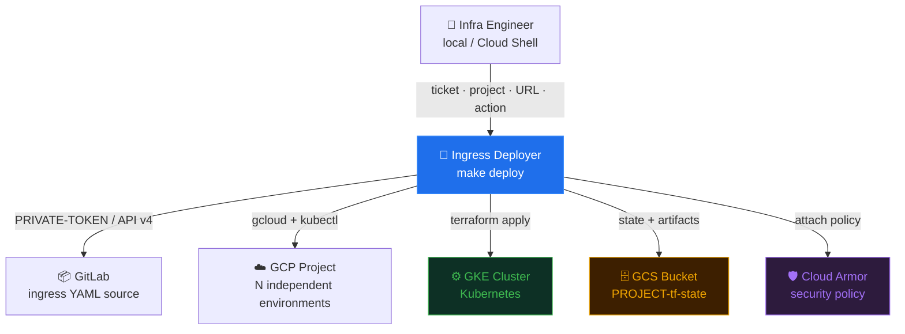
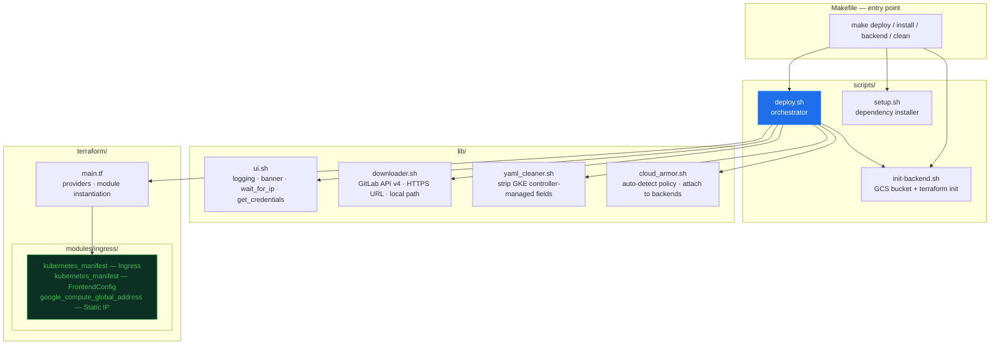
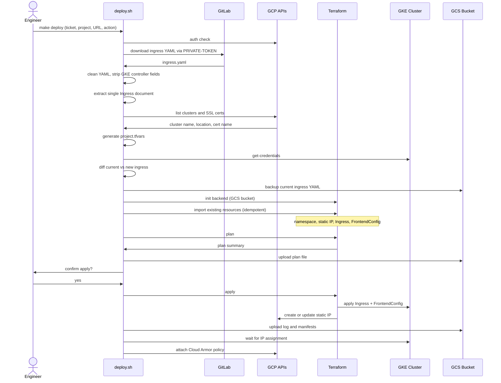

# Ingress Deployer — Architecture

**Audience:** DevOps / Infrastructure engineers  
**Last Updated:** 2026-06-04  
**Format:** Mermaid diagrams (render natively in GitLab, GitHub, VSCode)

---

## Contents

1. [System Context](#1-system-context)
2. [Internal Components](#2-internal-components)
3. [Deploy Sequence](#3-deploy-sequence)
4. [State Management](#4-state-management)
5. [Operational Gotchas](#5-operational-gotchas)

---

## 1. System Context

High-level view of actors and external systems. Each GCP project is an independent deployment target with its own GCS state bucket, GKE cluster, and Cloud Armor policy.



---

## 2. Internal Components

`deploy.sh` is the single orchestrator. All lib files are sourced functions — no subprocesses. The Terraform module is called once per run and manages exactly three GCP/K8s resources.



---

## 3. Deploy Sequence

Full happy-path for `ACTION=plan` followed by interactive apply. The `ACTION=apply` variant skips the confirmation prompt and runs plan+apply in one shot.



---

## 4. State Management

One GCS bucket per GCP project. Versioning is enabled automatically by `init-backend.sh`, enabling state rollback. Artifacts from every run are stored alongside the state for audit and rollback reference.

```mermaid
graph TB
    subgraph gcs["GCS — PROJECT-tf-state  versioning enabled"]
        tfstate["ingress/terraform.tfstate\nall versions retained"]
        subgraph art["ingress-artifacts / TICKET / YYYYMMDD"]
            plan["plan-HHMMSS.tfplan"]
            backup["ingress_backup_HHMMSS.yaml"]
            fc["frontendconfig.yaml"]
            log["deploy.log"]
        end
    end

    deploy["deploy.sh"] -->|"terraform init backend"| tfstate
    deploy -->|"gsutil cp"| art
    tf["Terraform"] -->|"read and write state"| tfstate
    tf -->|"terraform import idempotent"| tfstate

    style tfstate fill:#3d1f00,stroke:#f0a500,color:#f0a500
    style art fill:#161b22,stroke:#30363d
```



### Rollback procedure

```bash
# List state versions
gsutil ls -a gs://<project>-tf-state/ingress/terraform.tfstate

# Restore a specific version (replace #<VERSION> with generation number)
gsutil cp "gs://<project>-tf-state/ingress/terraform.tfstate#<VERSION>" \
  gs://<project>-tf-state/ingress/terraform.tfstate

# Or restore from backup YAML (faster for ingress-only rollback)
kubectl apply -f "$TICKETS_BASE/<TICKET>/ingress_backup_<DATE>_<TIME>.yaml"
```

---

## 5. Operational Gotchas

Issues encountered in production environments. Each entry includes the root cause and verified fix.

---

### IngressClass resource missing → LB controller silently ignores ingress

**Symptom:** Ingress created with no events, `ADDRESS` empty after 10+ hours. `kubectl describe` shows `Events: <none>`.

**Root cause:** `spec.ingressClassName: gce` in the ingress spec requires an `IngressClass` resource named `gce` to exist in the cluster. If it doesn't exist, the GKE LB controller ignores the ingress completely — no errors, no events.

```bash
# Verify
kubectl get ingressclass

# Fix — add legacy annotation (recognized by controller without IngressClass resource)
kubectl annotate ingress <name> -n <namespace> \
  kubernetes.io/ingress.class=gce --overwrite
```

---

### Multi-document YAML breaks `terraform yamldecode`

**Symptom:** `Error: Call to function "yamldecode" failed: on line N, column 1: unexpected extra content after value`

**Root cause:** Ingress YAMLs fetched from GitLab may contain multiple documents separated by `---` (e.g., Ingress + Service + Deployment). `yamldecode()` in Terraform only accepts a single YAML document.

**Fix:** `deploy.sh` runs `yq 'select(.kind == "Ingress")'` after `clean_ingress_yaml` to extract only the Ingress document before passing the file to Terraform.

---

### GitLab PRIVATE-TOKEN + gcloud Bearer → SAML redirect (HTML response)

**Symptom:** Downloaded YAML file contains HTML instead of YAML. `yq` validation fails with parse error.

**Root cause:** Sending `Authorization: Bearer <gcloud-token>` to a GitLab instance with SAML SSO configured returns a 302 redirect to the identity provider login page instead of the file.

**Fix:** `downloader.sh` routes URLs matching `/api/v4/projects/` exclusively with `PRIVATE-TOKEN` header. gcloud Bearer token is only used for non-GitLab GCP endpoints.

---

### Terraform GCS backend requires ADC — `gcloud auth login` alone is insufficient

**Symptom:** `Error: Error when reading or editing Storage Bucket` during `terraform init` despite valid `gcloud` session.

**Root cause:** Terraform's GCS backend authenticates via Application Default Credentials (ADC), not the `gcloud` CLI session.

**Fix:** Run both:
```bash
gcloud auth login                        # CLI session (gcloud, kubectl commands)
gcloud auth application-default login   # ADC (Terraform GCS backend)
```

---

### `.terraform.lock.hcl` is not a state lock

**Symptom:** Confusion when the file is present and developers assume Terraform is locked.

**Clarification:** `.terraform.lock.hcl` is the provider dependency lock file — it records provider versions and checksums. It is always present after `terraform init` and **must be committed to version control**. The actual state lock lives in GCS (released automatically on success or via `terraform force-unlock`).

---

### Forwarding rules in conflict → LB sync Error 400

**Symptom:** `Error syncing to GCP: error running load balancer syncing routine: ... googleapi: Error 400: Invalid value for field 'resource.IPAddress': '...'. Specified IP address is in-use and would result in a conflict.`

**Root cause:** One or more GCP forwarding rules already occupy the static IP before the GKE LB controller can build its managed stack. Common sources:
- Manual forwarding rules created outside GKE (e.g. a quick SSL termination rule named `https`)
- Orphan `k8s2-fr-*` GKE rules from a previous incomplete LB creation

**Fix (automated):** `deploy.sh` runs `check_ip_conflicts` before `terraform plan/apply` and offers to delete conflicting rules interactively.

```bash
# Manual resolution if needed
gcloud compute forwarding-rules list \
  --project=<project> --filter="IPAddress=<ip>"
gcloud compute forwarding-rules delete <rule-name> --global --project=<project>
```

**Note:** If the conflicting rule belongs to a different GKE ingress, the deployer will not offer to delete it — coordinate with the team owning that ingress first.

---

*See [README.md](../README.md) for operational usage, deployment commands, and troubleshooting reference.*
